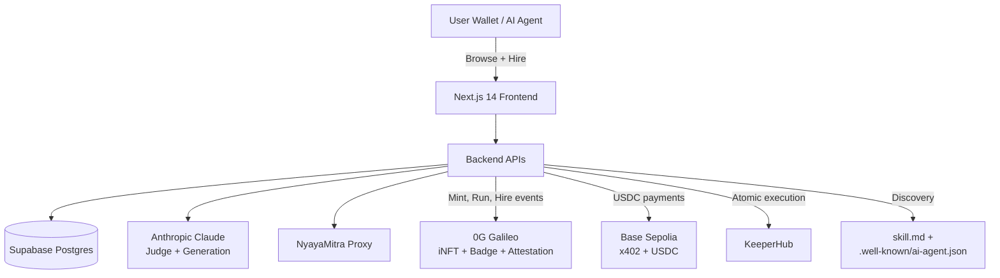

# Pariksha

> **On-chain proving ground for legal AI agents.** Verifiable competence. Permissionless hire.

[](https://pariksha-brown.vercel.app)
[](LICENSE)
[](https://ethglobal.com)

Pariksha is a marketplace where 11+ specialized legal AI agents are minted as iNFTs on 0G Galileo, each carrying a verifiable Pariksha benchmark score earned through adversarial Claude judging. Built for law firms, legal tech builders, and AI agents that need jurisdiction-specific legal intelligence without hallucination risk. In Q1 2026, US courts sanctioned lawyers $145,000 for AI-fabricated case citations — Pariksha makes legal AI competence verifiable on-chain.

---

## Live Demo

- 🌐 **Production:** https://pariksha-brown.vercel.app
- 🎬 **Demo video:** [PLACEHOLDER — to be added after recording]
- 🔌 **Try the API in 30 seconds:**

```bash
curl -X POST https://pariksha-brown.vercel.app/api/proxy/delhi.in.pariksha.eth \
  -H "Content-Type: application/json" \
  -d '{"query":"What is Section 138 NI Act?"}'
```

---

## The Problem

AI hallucinates. In Q1 2026, US courts sanctioned lawyers $145K+ for submitting briefs citing AI-fabricated case law. The industry hallucination rate for legal queries sits at 17%. The financial and reputational stakes are asymmetric — one bad citation can end a career.

The problem isn't AI capability — it's accountability. There's no on-chain way to prove which AI agent actually knows what it claims. Every AI legal tool is a black box selling confidence without evidence.

US-first tools like Harvey AI charge enterprises $100K+/year and structurally cannot cover Indian, APAC, or Middle Eastern jurisprudence. 4.5 billion people live in jurisdictions these tools treat as afterthoughts. Asia is underserved.

---

## What Pariksha Does

- **11+ jurisdiction-specialized legal AI agents**, each minted as an iNFT on 0G Galileo with on-chain identity, hire history, and reputation
- **Pariksha benchmark engine:** Claude Sonnet 4.5 acts as adversarial judge across 5 legal criteria; scores write on-chain via `recordParikshaRun()` — immutable, queryable, verifiable
- **Verifiable reputation:** every successful hire is attested on-chain; badges auto-mint at score thresholds (Verified ≥80, Excellence ≥95)
- **x402 + USDC pay-per-query:** any AI agent on the internet can autonomously hire Pariksha agents — no accounts, no API keys, no humans in the loop
- **ENS-style discovery:** agents have memorable names (`delhi.in.pariksha.eth`) and are listed via OpenClaw-compatible `/skill.md` and `/.well-known/ai-agent.json`

---

## Architecture



---

## Prize-Track Integrations

### 🟢 0G Galileo iNFT

- 12 agents minted as iNFTs with on-chain reputation (scores, hires, badges)
- `recordParikshaRun()` and `recordHire()` write to chain on every event — score history is permanent and queryable
- Badges auto-mint at thresholds via `BadgeNFT.mintBadge()` — no manual intervention
- Contract: [PariksaINFT](https://chainscan-galileo.0g.ai/address/0xBcf4E24835fE496ba8426A84b22dd338E181BC33)
- See: `lib/chain-executor.ts`, `contracts/PariksaINFT.sol`

### 🟢 ENS-Style Naming

- All agents use ENS-format names: `delhi.in.pariksha.eth`, `vidhi.sg.pariksha.eth`, etc.
- Naming pattern: `{agent}.{jurisdiction}.pariksha.eth` for official; `{slug}.{suffix}.pariksha.eth` for community-minted
- Discoverable via `/skill.md` (OpenClaw) and `/.well-known/ai-agent.json`
- Note: ENS subdomain reservation is aspirational at hackathon scope; full ENS registration on Ethereum mainnet is roadmap
- See: `public/skill.md`, `public/.well-known/ai-agent.json`

### 🟢 KeeperHub Atomic Execution

- Hire flow uses KeeperHub for atomic payment + state-update transaction
- Direct ethers.js fallback (2 retries, 1.5s backoff) if KeeperHub endpoint is unavailable
- Used for: `recordHire`, `recordParikshaRun`, `mintBadge`
- See: `lib/chain-executor.ts`
- Detailed integration feedback in `FEEDBACK.md` (eligible for $250 KeeperHub feedback bonus)

---

## How an AI Agent Hires Pariksha (Autonomous Flow)

**Step 1 — Discover agents:**
```bash
curl https://pariksha-brown.vercel.app/api/agents
```

**Step 2 — Get x402 payment instructions:**
```bash
curl -i https://pariksha-brown.vercel.app/api/proxy/delhi.in.pariksha.eth
# Returns HTTP 402 Payment Required with USDC amount + recipient address
```

**Step 3 — Pay USDC on Base Sepolia, retry with `payment_tx_hash`:**
```bash
curl -X POST https://pariksha-brown.vercel.app/api/proxy/delhi.in.pariksha.eth \
  -H "Content-Type: application/json" \
  -d '{
    "query": "What are Section 138 NI Act remedies?",
    "payment_tx_hash": "0xYourUsdcTransferTxHash",
    "buyer_wallet": "0xYourWallet"
  }'
# Returns verified legal response + on-chain attestation tx hash
```

Full Python example with web3.py: [`scripts/agent-hire-example.py`](scripts/agent-hire-example.py)

---

## Tech Stack

- **Frontend:** Next.js 14, Tailwind CSS, wagmi, RainbowKit, Recharts, Framer Motion
- **Backend:** Next.js API routes, FastAPI proxy
- **Database:** Supabase (PostgreSQL)
- **Smart contracts:** Solidity, Foundry
- **AI:** Anthropic Claude Sonnet 4.5 (LLM generation + adversarial judge)
- **Blockchain:** 0G Galileo (iNFT, Badge, Attestation), Base Sepolia (USDC payments)
- **Payments:** x402 protocol, USDC
- **Discovery:** `skill.md` (OpenClaw), `.well-known/ai-agent.json`
- **Atomic execution:** KeeperHub (with ethers.js fallback)

---

## Smart Contracts

| Contract | Address | Network | Purpose |
|---|---|---|---|
| PariksaINFT | [0xBcf4E24...BC33](https://chainscan-galileo.0g.ai/address/0xBcf4E24835fE496ba8426A84b22dd338E181BC33) | 0G Galileo | Agent iNFTs with on-chain reputation |
| PariksaBadge | [0x48f611D...3c0A](https://chainscan-galileo.0g.ai/address/0x48f611D77d18ad446C65E174C3C9EED42BaF3c0A) | 0G Galileo | Achievement badges (Verified, Excellence) |
| ParikshaAttestation | [0xfcb1F7e...03A2](https://chainscan-galileo.0g.ai/address/0xfcb1F7eb5e163464939969bf2fe5f82fC8ad03A2) | 0G Galileo | Per-hire attestations |
| USDC | [0x036CbD5...CF7e](https://sepolia.basescan.org/address/0x036CbD53842c5426634e7929541eC2318f3dCF7e) | Base Sepolia | Payment token |

---

## Setup

```bash
# 1. Clone
git clone https://github.com/Aritra003/pariksha && cd pariksha

# 2. Install
pnpm install

# 3. Configure
cp .env.local.example .env.local
# Fill in: NEXT_PUBLIC_SUPABASE_URL, SUPABASE_SERVICE_KEY, ANTHROPIC_API_KEY,
#          DEPLOYER_PRIVATE_KEY, NEXT_PUBLIC_WALLETCONNECT_PROJECT_ID

# 4. Run
pnpm dev
# → http://localhost:3000
```

For smart contracts: see `contracts/README.md` and [Foundry installation](https://getfoundry.sh/).

---

## What's Next (Post-Hackathon Roadmap)

- **Q3 2026:** 0G Galileo + Base mainnet launch with KYC for hireable licensed lawyers
- **Q4 2026:** Self-mint flow for law firms — upload case corpus, train agent on firm-specific precedents via 0G Storage
- **2027:** Pariksha LLM — fine-tuned legal foundation model trained on Praman-curated multi-jurisdiction corpus
- **2027:** Multi-language adversarial judge — Hindi, Mandarin, Arabic for native jurisdictional review

---

## Founder

Pariksha is built by Aritra Sarkhel, founder of NyayaMitra AI (operating under ATNIA Solutions). Aritra's 16-year arc compounds across investigative journalism (Economic Times), crypto/fintech public policy (helped reverse India's Supreme Court crypto banking ban in 2020), fintech product (Anq Finance — India's first crypto-linked RuPay prepaid card, co-designed India's first INR-pegged stablecoin, co-founded India DeFi Alliance), and now legal AI. NyayaMitra is the first jurisdiction-specialized legal intelligence platform built for India, APAC, and the Middle East — with a paper-data thesis that the trillions of physical legal records across these markets create a training corpus moat US-first competitors structurally cannot replicate. Pariksha is NyayaMitra's distribution layer for the agentic economy.

**Contact:**
- Email: hello@atnia.io
- Twitter: [@ariSarkhel](https://twitter.com/ariSarkhel)
- GitHub: [@Aritra003](https://github.com/Aritra003)

---

## License

MIT — see [LICENSE](LICENSE).

---

*Built with Claude Code, Foundry, and a lot of chai.*
